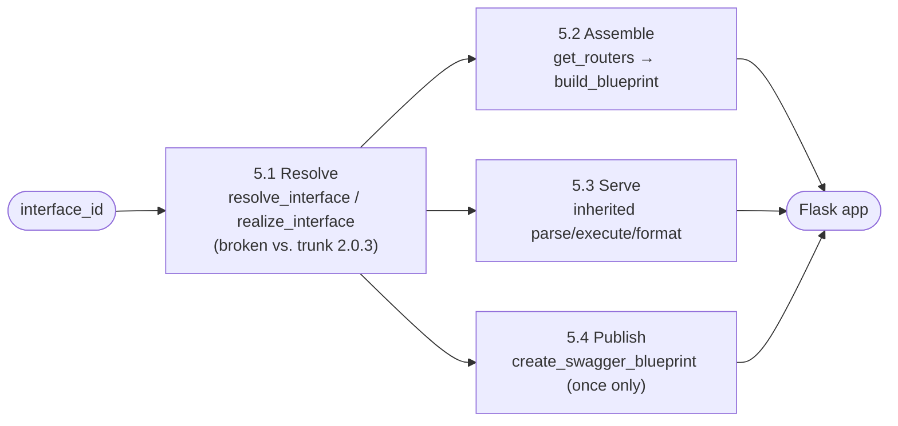

**Status:** Draft · **Domain:** `tiferet-flask` · **Code:** `tiferet_flask/` · **Branch:** `v1.x-proto`
**Companion:** `docs/domain-vision.md`

# tiferet-flask: Core Domain Distillation

## 1. Purpose of this document
The vision statement says what tiferet-flask is for: turning a declaration tiferet-openapi already owns into a running Flask server and a browsable documentation page, without re-deciding anything about what a route means. This document says how the domain does that *today*, in the code actually on disk, and — because that code was written against a shape tiferet-openapi has since replaced — where today's shape stops matching what it is expected to extend. It is the reference the next RFP or TRD should be measured against, not a description of a finished, stable domain.

## 2. The core domain, restated precisely
tiferet-flask's core domain is **assembling a runnable Flask application, and a Flask-servable documentation page, from route declarations and session behavior that are fully owned elsewhere.**

The domain has one fixed shape:

> **Resolve** (load the declared session and its event collaborators) → **Assemble** (map each declared router to a Flask `Blueprint`, each route to a URL rule) → **Serve** (delegate request parsing, execution, and response/error formatting to the inherited session context) → **Publish** (expose the generated specification as a browsable Swagger UI page, without regenerating or re-registering it redundantly)

and one axis of variation, which is also this document's central finding:

1. **Composition-pattern currency** — whether tiferet-flask's `Resolve`/`Assemble` steps are wired against the `AppInterfaceContext`-era pattern (`resolve_interface`/`realize_interface`, a `get_routers_handler()` accessor) it was originally written against, or the `AppSessionContext`-era pattern (`AppSession`, `compose_session_context`, constructor-injected event collaborators) that both tiferet trunk (`tiferet>=2.0.3`) and tiferet-openapi's `OpenApiSessionContext` have already moved to. This is not a designed axis; it is the gap this document exists to name.

## 3. Ubiquitous language
**`FlaskApiContext`** — the sole context this domain defines (`tiferet_flask/contexts/flask.py`). Declared as `class FlaskApiContext(OpenApiContext)`, adding `create_swagger_blueprint()` and overriding `create_docs_handler()`. `OpenApiContext` no longer exists in tiferet-openapi at its current commit (Section 8.1) — this class's base is broken today, not merely outdated.

**`FlaskRequestContext`** — an alias for `tiferet_openapi.OpenApiRequestContext` (`tiferet_flask/contexts/request.py`). Not affected by the composition-pattern break; `OpenApiRequestContext` is unchanged.

**Blueprint functions** — the stateless functions in `tiferet_flask/blueprints/flask.py`: `get_routers(interface_context)`, `build_blueprint(router, view_func)`, `build_flask_app(interface_id, view_func, swagger=False, **parameters)` (exported as `FlaskApp`), and `run(...)`, a thin alias for `build_flask_app`.

**`create_swagger_blueprint`** — `FlaskApiContext`'s own method. Calls `self.generate_spec(...)` once, builds a Flask `Blueprint` named `'swagger'` with two routes (`/docs/openapi.json`, `/docs/`), and returns it. Nothing in the current code path calls it more than once per `build_flask_app` invocation, but nothing prevents a caller from invoking it twice either — no guard exists against double registration (Section 8.3).

**`create_docs_handler`** — in tiferet-flask, an override that delegates straight to `create_swagger_blueprint(**kwargs)`, returning a `Blueprint`. In tiferet-openapi's current `OpenApiSessionContext`, the *same method name* now means something structurally different: a deprecated, data-returning alias for `get_docs_spec()` that emits a `DeprecationWarning` (Section 8.2). Re-parenting `FlaskApiContext` without addressing this collision would leave two incompatible contracts sharing one method name.

**`get_docs_spec`** — `OpenApiSessionContext`'s current, non-deprecated accessor for the generated specification dict. tiferet-flask does not call it anywhere today; `create_swagger_blueprint` calls the lower-level `generate_spec` directly instead.

**`get_routers_handler`** — a method name tiferet-flask's `get_routers()` blueprint function and its tests assume exists on the realized interface context. It does not exist anywhere in tiferet-openapi's current source (Section 8.1). It is inherited assumption, not working code, against the dependency's present shape.

**`resolve_interface` / `realize_interface`** — functions `tiferet_flask/blueprints/flask.py` imports from `tiferet.blueprints.main`. That module does not exist on tiferet trunk at `tiferet==2.0.3` (Section 8.1); trunk's replacement composition primitives are `AppSession`, `CacheContext`, and `tiferet.blueprints.core.compose_session_context`, which tiferet-openapi's own `build_openapi_session_context` already uses as its template.

## 4. What the domain reads / operates on
`build_flask_app` takes an `interface_id` and a `view_func`, plus a `swagger` flag and free-form `**parameters` forwarded to interface resolution. It does not itself read any YAML — resolving the declared session and its `ApiRouter`/`ApiRoute` data is entirely tiferet-openapi's and tiferet's responsibility, reached through whatever resolution/composition function this domain calls.

The one piece of state this domain's `Publish` step must not read twice, in the same sense a repository read is idempotent, is the generated specification: `create_swagger_blueprint` calls `generate_spec` once when the blueprint is built. If a future caller invokes `create_swagger_blueprint` (or its replacement) more than once against the same Flask app — once directly, once through a duplicated build path, or once per worker in a multi-process server without a build-time guard — the result is either a Flask blueprint-name collision or, if the guard is loose enough to swallow that, two independently generated specification payloads underlying what a client perceives as one set of documented routes. This is a named design constraint for the eventual overhaul (Section 8.3), not yet a reproduced defect — no historical test or commit currently pins it down.

## 5. The behaviors

### 5.1 Resolving the session
*Turn an interface id into a realized context this domain can assemble routes from.*

Today, `build_flask_app` (`tiferet_flask/blueprints/flask.py:71-112`) calls `resolve_interface(interface_id, **parameters)` then `realize_interface(app_interface, interface_id)`, both imported from `tiferet.blueprints.main`.

**Verdict:** broken against current tiferet trunk. Neither function exists at `tiferet==2.0.3` (Section 8.1). This step cannot run unmodified once tiferet-flask's `tiferet`/`tiferet-openapi` floors are raised to match tiferet-openapi's own `tiferet>=2.0.3` dependency.

### 5.2 Assembling the Flask app
*Map each declared router to a Flask `Blueprint`, each route to a URL rule, one view function per route.*

`get_routers(interface_context)` calls `interface_context.get_routers_handler()`; `build_blueprint(router, view_func)` (`tiferet_flask/blueprints/flask.py:36-67`) walks `router.routes` and calls `blueprint.add_url_rule(route.path, route.id, methods=route.methods, view_func=view_func)` for each one — an agnostic, correct mapping of tiferet-openapi's own `ApiRouter`/`ApiRoute` fields onto Flask's own primitive, independent of the composition-pattern break.

**Verdict:** the route-to-Blueprint mapping itself (`build_blueprint`) is sound and framework-idiomatic; only its *input* — `get_routers`, which depends on a method that no longer exists — is broken (Section 8.1).

### 5.3 Serving a request
*Parse, execute, and format a request/response/error, without tiferet-flask re-deciding any of it.*

`FlaskApiContext` adds no request-handling code of its own; it inherits `parse_request`, `handle_error`, `handle_response` (or, under the current base, whatever `OpenApiContext` supplied) entirely from its base class. The view function in a consuming app calls `context.run(feature_id=..., headers=..., data=...)` and returns `jsonify(response), status_code`.

**Verdict:** this is exactly the inheritance discipline the vision commits to — zero Flask-specific request/response/error logic exists in this domain today. The only open question is which base class `FlaskApiContext` inherits this behavior *from* (Section 8.1), not whether the inheritance pattern itself is right.

### 5.4 Publishing documentation
*Expose the generated specification as a browsable Swagger UI page, generated and registered exactly once.*

`create_swagger_blueprint` (`tiferet_flask/contexts/flask.py:19-58`) generates the spec, builds a `Blueprint` with a CDN-hosted Swagger UI page and a raw `/openapi.json` route, and returns it; `build_flask_app` registers it when `swagger=True`. `create_docs_handler` (`tiferet_flask/contexts/flask.py:61-73`) is a thin, same-behavior alias.

**Verdict:** functionally the domain's most complete behavior today, but it inherits two problems from the overhaul this document is scoping rather than fixing: (a) it is written against the retired `create_docs_handler` contract, which the base class has since repurposed for something else entirely (Section 8.2); and (b) it has no explicit guard against being invoked more than once per app build, which is the condition under which duplicated route entries could reach a client-facing Swagger UI page (Section 8.3). Both are named findings for the next design pass, not yet fixed here.

## 6. How the behaviors compose
Resolve runs once per `build_flask_app` call; Assemble runs once per resolved router; Serve runs once per incoming HTTP request; Publish runs once per app build, and must stay that way — repeating it is the failure mode named in Section 5.4.

Publish depends on Resolve producing a context capable of generating a spec, but not on any request having been served — a Swagger page can exist before the first request arrives. Assemble and Publish are independent of each other but both depend on the same resolved context, which is exactly why a Resolve-level fix (Section 8.1) is a precondition for either one working again.

## 7. Relationships / cross-boundary rules
`FlaskApiContext` only ever adds to its base class; it does not talk to `OpenApiService`, a domain event, or a repository directly — every fact about routes, errors, or specification content is retrieved through whatever the base class already exposes. This discipline holds regardless of which base class shape wins (Section 8.1); it is a property of tiferet-flask's design, not of the version currently on disk.

The blueprint functions (`tiferet_flask/blueprints/flask.py`) are the only place this domain talks to Flask's own `Blueprint`/`Flask` types directly. `tiferet_flask/contexts/flask.py` talks to Flask only for the Swagger page (`Blueprint`, `Response`, `jsonify`) — it does not import Flask's request/response machinery for ordinary route serving, which stays inherited (Section 5.3).

## 8. The agnostic core and the variable edge

**Agnostic — built once, shared regardless of which router/route is declared:**
- `build_blueprint`'s route-to-`add_url_rule` mapping (Section 5.2).
- Delegating request/response/error formatting entirely to the inherited session context (Section 5.3).
- The Swagger UI page template and the `/openapi.json` route shape (Section 5.4), independent of what the underlying spec contains.

**Variable — one choice per consuming application:**
- The `view_func` a consuming app supplies.
- Whether `swagger=True` is passed at all.
- The `interface_id` and any `**parameters` forwarded to session resolution.

**Currently entangled — the honest inventory:**

**8.1 — The composition pattern is broken, not merely outdated.** `FlaskApiContext(OpenApiContext)` imports a class (`OpenApiContext`) that no longer exists in tiferet-openapi's current `__init__.py` exports — only `OpenApiSessionContext(AppSessionContext)` is exported now. `tiferet_flask/blueprints/flask.py` imports `resolve_interface`/`realize_interface` from `tiferet.blueprints.main`, a module that does not exist on tiferet trunk at `tiferet==2.0.3` (grepped: zero hits for `AppInterfaceContext`, `resolve_interface`, or `realize_interface` anywhere in `tiferet/blueprints/core.py` or `tiferet/contexts/app.py`). `get_routers()`'s dependency on `interface_context.get_routers_handler()` fails the same way — that accessor does not exist on `OpenApiSessionContext`, which only exposes routers internally through a private, constructor-injected `_get_routers_evt`. All three are the same underlying finding: tiferet-flask was last wired against the `AppInterfaceContext` era, and both its direct dependency (tiferet-openapi) and its transitive one (tiferet) have since moved to the `AppSessionContext`/`compose_session_context` composition pattern. `tiferet_openapi.blueprints.openapi.build_openapi_session_context` is the concrete template tiferet-flask's own resolve/assemble step should end up mirroring.

**8.2 — `create_docs_handler` means two different things depending on which base class wins.** In tiferet-flask today, it is a `Blueprint`-returning hook. In `OpenApiSessionContext`, the same name is now a deprecated, dict-returning alias for `get_docs_spec()`, retained for exactly one release and slated for removal at the "full v1.0.0 release." Simply re-parenting `FlaskApiContext` onto `OpenApiSessionContext` without renaming or redesigning this method would either silently break tiferet-flask's own contract or collide with the base class's deprecated one. The design direction for the overhaul (per discovery discussion) keeps a Swagger blueprint wrapping the specification accessor — but as a method that explicitly wraps `get_docs_spec()`, not as a same-named override of the base's own deprecated alias, and it must be safe to call at most once effectively per app build (Section 8.3) rather than being re-invoked as a side effect of both an explicit `swagger=True` path and any other docs-serving path a consuming app might wire up.

**8.3 — No guard exists against generating or registering the Swagger page more than once.** `create_swagger_blueprint` neither memoizes its generated spec nor checks whether a `'swagger'` blueprint has already been registered on the target Flask app. Today, `build_flask_app` only calls it from one place, so the risk is latent, not reproduced — no test or historical commit currently exercises a double-call. But it is a named constraint for the overhaul: whatever replaces `create_swagger_blueprint`/`create_docs_handler` must make a second invocation either a no-op or an explicit error, not a second, independently generated specification whose routes render twice on the documentation page.

**8.4 — The package's own version claim does not match its actual release status.** `tiferet_flask/__init__.py` and `AGENTS.md` both declare `1.0.0b1`, and the git tag `v1.0.0b1` exists on `v1.x-proto`. Per discovery discussion, no confirmed package release under that version number exists. Treating the currently landed shape as the true `1.0.0b1` would mean claiming a beta-stability contract for code with a broken import chain (Section 8.1) — for the purposes of this discovery and the milestone it feeds, the landed shape is being treated as pre-release (`1.0.0a1`-equivalent), and `1.0.0b1` is the version this milestone's work is expected to actually earn once Sections 8.1–8.3 are resolved.

**8.5 — Declared dependency floors understate the real gap.** `pyproject.toml` declares `tiferet-openapi>=1.0.0b1` and no direct `tiferet` floor (transitive only). tiferet-openapi's `v1.0.0b1` has since been cut as a real GitHub release (confirmed via `gh release list`, tagged and published) — as of this refresh it is not yet resolvable from PyPI, only from the git tag, so `tiferet-openapi>=1.0.0b1` still cannot be satisfied by a plain `pip install` until it lands there. The floor that actually matters regardless is tiferet-openapi's *current* dependency contract, `tiferet>=2.0.3`, which tiferet-flask does not declare at all today and whose absence is exactly why a `.venv` can silently carry a stale, incompatible `tiferet` alongside a compatible-looking `tiferet-openapi` pin — reproduced firsthand in this refresh (Section 8.6).

**8.6 — A local dev environment can go stale independently of the source, and did.** Re-verifying this discovery against a fresh install surfaced three apparent breaks — `from tiferet import Yaml` failing, `contexts/__init__.py` still importing a class named `OpenApiContext`, and a missing `tiferet_openapi.blueprints` subpackage — that turned out to be artifacts of a `tiferet-openapi` copy installed into this repo's `.venv` on May 18, months before the real `v1.0.0b1` cut. Reinstalling both `tiferet` and `tiferet-openapi` editable from their current local checkouts (which match their respective `v2.0.3`/`v1.0.0b1` tags exactly) makes every one of those imports succeed: `OpenApiSessionContext`, `ApiRoute`, `ApiRouter`, `tiferet_openapi.blueprints.openapi.build_openapi_session_context`, `create_openapi_request_context`, and `OpenApiYamlRepository` all import cleanly against `tiferet==2.0.3`. Sections 8.1 through 8.5 were derived from reading source directly rather than from this stale install, so they are unaffected — this entry exists so the same false trail isn't re-walked, and as a reminder that any future compatibility check in this repo's `.venv` needs a forced reinstall first.

**8.7 — `context.run()` raises on error; nothing in this domain catches it yet.** `AppSessionContext.run()` (`tiferet/contexts/app.py:369-418`) catches `TiferetError` internally but then calls `return self.handle_error(e, **kwargs)` — and `handle_error`, both at the hub level and in `OpenApiSessionContext`'s override, always either re-raises the incoming `TiferetAPIError` verbatim or raises a newly-formatted one (with `.status_code` attached). It never returns a value. So a Flask view function that does `response, status_code = context.run(...)`, as tiferet-flask's own README documents, will not get an error tuple back on failure — it will get an uncaught `TiferetAPIError` propagating out of the view function, which Flask converts to a generic 500 HTML page, not the structured, status-coded JSON response the vision promises. Nothing in `tiferet_flask/blueprints/flask.py` or `tiferet_flask/contexts/flask.py` today registers a Flask-level error handler (e.g. `@flask_app.errorhandler(TiferetAPIError)`) to catch this and convert it to a response. This is independent of the composition-pattern break (8.1): even a correctly re-parented `FlaskApiContext` would still need this handler to make error responses actually reach a client.

**8.8 — tiferet-fast is not a source of shared Swagger/CDN code, and is further behind than tiferet-flask.** Checked directly: `tiferet_fast/blueprints/fast.py` has no hand-rolled documentation page at all — it relies entirely on FastAPI's own built-in `/docs` and `/redoc`, which FastAPI generates itself (also CDN-backed by default, configurable via `swagger_js_url`/`swagger_css_url` and `StaticFiles`, but nothing in tiferet-fast touches that today). tiferet-fast is also still wired against the retired `tiferet.blueprints.main` (`resolve_interface`, `realize_interface`, `create_service_provider`) and never adopted `OpenApiSessionContext`/`build_openapi_session_context` at all — its composition-pattern debt is broader than tiferet-flask's, not parallel to it. Conclusion: there is no existing duplicated Swagger implementation between the two adapters to consolidate right now. If tiferet-fast later wants a non-CDN docs page, the only piece worth sharing is the *vendored static asset bundle* (the `swagger-ui-dist` JS/CSS files as inert package data) — never the serving glue, which is unavoidably framework-specific (Flask `Blueprint` vs. FastAPI `StaticFiles`/`get_swagger_ui_html`) and would require tiferet-openapi to import a web framework, breaking its own stated boundary (Section 9 of its distillation: rendering a documentation page is the adapter's job). That extraction is a future tiferet-openapi RFP to raise once a second real consumer exists, not a v1 tiferet-flask dependency.

**8.9 — `AppSession` already has a declarative extension point for CORS; it doesn't need a new field.** `tiferet.domain.app.AppSession` (`tiferet/domain/app.py:30-89`) is the base session object every Tiferet app (CLI included) is built from — it has no HTTP-specific fields today, which is correct: CORS is meaningless to a CLI session and doesn't belong in a framework-agnostic core object. It does, however, already carry `constants: Dict[str, str]`, the existing mechanism by which a declared session hands scalar configuration to whatever collaborator's constructor asks for it by name (the same mechanism tiferet-flask's own `AGENTS.md` already documents for `openapi_yaml_file`). Reading CORS options from `AppSession.constants` at compose time — rather than only accepting a Python-side `cors_options` kwarg to `build_flask_app` — gets "CORS is part of the declared session, not hardcoded" without requiring a cross-repo TRD against tiferet's core domain object. A dedicated `cors` field on `AppSession` itself would need its own tiferet trunk TRD and is the wrong layer for an HTTP-only concern; `constants` is the already-idiomatic path and available today.

**8.10 — tiferet has moved to `tiferet>=2.1.1`, with a real unit-test harness rewrite worth adopting alongside the composition-pattern fix.** Confirmed via `gh release view`: `v2.1.0` ("Tester as Unit Tests, Not a Mini-App") replaced the old `AggregateTestBase`/`DomainEventTestBase`-style harness with `@use_tester`, `TestSessionContext(RequestContext)`, and a single `TesterObject` with `type` extensions (`'generic'` default, `'repo'`, `'context'`); `v2.1.1` followed with a test-module grammar (`# *** fixtures` → `# *** tests` → `# *** testers`) and repo-tester dogfood examples. Both releases report no breaking changes to runtime APIs (`AppSession`, `AppSessionContext`, `compose_session_context`, etc. are untouched) — confirmed firsthand: `tiferet_openapi` 1.0.0b1 imports cleanly against `tiferet==2.1.1` with no changes needed. tiferet-flask's own test suite is already fully stale against the composition-pattern break (8.1) and needs a full rewrite regardless (it mocks `FeatureContext`/`ErrorContext`/`LoggingContext` directly and constructs `FlaskApiContext` with a retired constructor signature) — doing that rewrite against the new `@use_tester` harness instead of the old mock-heavy pattern is the same amount of necessary work, aimed at the current standard instead of a second retired one. This raises tiferet-flask's floor from `tiferet>=2.0.3` (inherited from tiferet-openapi) to `tiferet>=2.1.1` if the new harness is adopted for v1.

## 9. Boundaries
**Inside the domain:** resolving a declared session into a Flask app; mapping declared routers/routes onto Flask `Blueprint`/`add_url_rule`; enabling CORS; exposing the generated specification through a Flask-servable Swagger UI page, generated and registered exactly once per app build.

**Outside the domain, and who owns it instead:**
- Declaring routes, shapes, and error mappings, and generating the OpenAPI specification from them — owned entirely by tiferet-openapi.
- Deciding how an error maps to a status code, or how a response pairs with one — owned by the inherited session context, not reimplemented here.
- The composition primitives (`AppSession`, `CacheContext`, `compose_session_context`) this domain's `Resolve` step must be rebuilt against — owned by tiferet trunk, consumed here.
- What a route's business logic does — owned by the feature the route's endpoint names.

## 10. Where this leads
1. **Confirmed, not yet fixed:** the composition-pattern break (8.1) means `tiferet_flask/blueprints/flask.py` and `tiferet_flask/contexts/flask.py` both need a rewrite against `AppSessionContext`/`compose_session_context`-style construction, mirroring `tiferet_openapi.blueprints.openapi.build_openapi_session_context`, before anything else in this domain can be verified to actually run.
2. **Design direction set, not yet implemented:** the Swagger-publishing overhaul (8.2, 8.3) keeps a blueprint wrapping the specification accessor, redesigned around `get_docs_spec()` rather than colliding with the base class's deprecated `create_docs_handler`, and made explicitly safe against being invoked more than once per app build.
3. **Newly confirmed, not yet designed:** the error-contract gap (8.7) means the rewrite also needs a Flask-level error handler converting a raised `TiferetAPIError` into a structured, status-coded JSON response — without it, the composition-pattern rewrite alone would still leave every error path returning a generic Flask 500 page.
4. **Confirmed by this refresh:** tiferet-openapi's `v1.0.0b1` (8.5, 8.6) is a real, tagged, buildable release whose source imports cleanly against `tiferet==2.0.3` — the substrate this milestone targets is solid; tiferet-flask's own gaps (8.1, 8.2, 8.3, 8.7) are what remain to close against it.
5. **Decided, for documentation purposes:** the currently landed shape is treated as pre-`1.0.0b1` (8.4) despite its git tag; this milestone's work is what earns a real `1.0.0b1`, and the dependency floors (8.5) should end up naming `tiferet>=2.0.3` directly rather than relying on a transitive `tiferet-openapi` floor that PyPI does not resolve yet.
6. **Not yet done:** an RFP or TRD scoping the actual rewrite. This document and its companion vision statement are the discovery artifacts that scoping work should cite; no code has changed as part of producing them.
