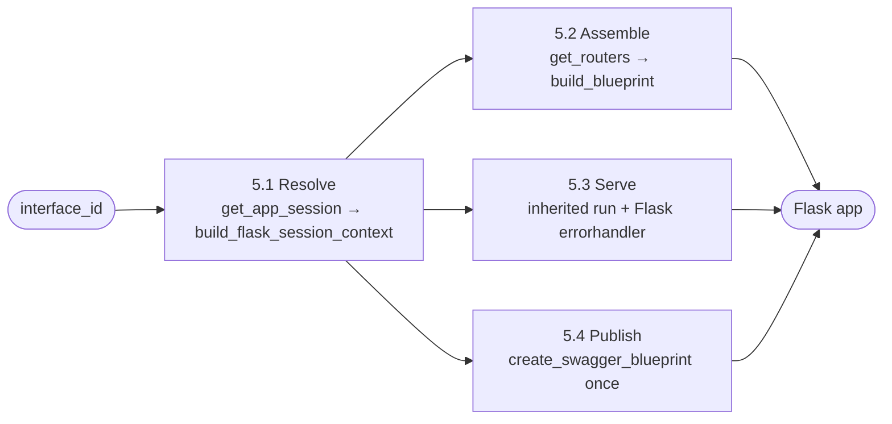

**Status:** Draft · **Domain:** `tiferet-flask` · **Code:** `tiferet_flask/` · **Branch:** `v1.x-proto`
**Companion:** `docs/domain-vision.md`

# tiferet-flask: Core Domain Distillation

## 1. Purpose of this document
The vision statement says what tiferet-flask is for: assembling a running Flask server and a browsable documentation page from a declaration this package does not own. This document says how that work is shaped: its vocabulary, its bounded steps, which of those steps are fixed and which vary per consuming app, and the relationships between the pieces. It is the conceptual reference a later RFP or TRD should be measured against.

## 2. The core domain, restated precisely
tiferet-flask's core domain is **assembling a runnable Flask application, and a Flask-servable documentation page, from route declarations and session behavior that are fully owned elsewhere.**

The domain has one fixed shape:

> **Resolve** (load the declared session and its event collaborators) → **Assemble** (map each declared router to a Flask `Blueprint`, each route to a URL rule) → **Serve** (delegate request parsing, execution, and response/error formatting to the inherited session context; convert a raised API error into structured JSON) → **Publish** (expose the generated specification as a browsable Swagger UI page, without regenerating or re-registering it redundantly)

and three axes of variation:

1. **Which session is resolved** — the `interface_id` and any parameters forwarded into session load.
2. **Whether documentation is mounted** — `swagger=True` or not.
3. **How CORS is declared** — which `cors_*` keys, if any, the session's `constants` map carries. Absent keys mean the library default (wide-open CORS).

## 3. Ubiquitous language
**`FlaskApiContext`** — the sole context this domain defines (`tiferet_flask/contexts/flask.py`). It extends the shared API session context (`OpenApiSessionContext`) without declaring its own `domain_type`. It adds `get_routers()` and `create_swagger_blueprint()`. It does not override `create_docs_handler`.

**`FlaskRequestContext`** — an alias for the shared request context (`OpenApiRequestContext`) that serializes Pydantic models via `model_dump()`.

**Blueprint functions** — the stateless functions in `tiferet_flask/blueprints/flask.py`: `build_flask_session_context`, `get_routers`, `build_blueprint`, `build_flask_app` (exported as `FlaskApp`), `run`, `handle_tiferet_api_error`, and `parse_cors_options`.

**`build_flask_session_context`** — composes a `FlaskApiContext` from a resolved `AppSession` and `CacheContext` via `compose_session_context`. Defaults the request handler to `create_openapi_request_context` so responses keep Pydantic serialization. The realized type is `FlaskApiContext`, not the shared base, because Publish lives on the subclass.

**`get_routers`** — on the context, a public wrapper around the injected routers event. The blueprint function of the same name calls that wrapper. Assemble never reaches into private event attributes.

**`create_swagger_blueprint`** — `FlaskApiContext`'s renderer. Calls `get_docs_spec()` once, caches the Flask `Blueprint` named `'swagger'` (`url_prefix='/docs'`), and serves `/docs/openapi.json` plus a Swagger UI page from vendored static assets. A second call on the same instance returns the cached blueprint and does not regenerate the spec.

**`get_docs_spec`** — the shared session context's accessor for the generated specification dict. This domain renders that data; it does not generate the specification.

**`handle_tiferet_api_error`** — Flask errorhandler for `TiferetAPIError`. Returns JSON `{error, message}` matching `ApiErrorResponse` and the HTTP status already attached to the exception. Registered once on the assembled Flask app.

**`parse_cors_options`** — reads a closed set of `cors_*` string keys from `AppSession.constants` and returns kwargs for `flask_cors.CORS`. Unknown keys are ignored. An empty result means today's library default.

## 4. What the domain reads / operates on
`build_flask_app` takes an `interface_id` and a `view_func`, plus a `swagger` flag and free-form `**parameters` forwarded to session load. It does not itself read YAML. Session load (`build_cache`, `get_app_session`) and the shared declaration of routers, routes, and error mappings belong upstream; this domain consumes the resolved `AppSession` and the composed `FlaskApiContext`.

The one piece of state Publish must not read twice is the generated specification. `create_swagger_blueprint` snapshots `get_docs_spec` on first call. A second invocation is a no-op (cached blueprint), not a second independently generated document.

CORS options are session data, not constructor collaborators and not a Python kwarg on `build_flask_app`. They live in `AppSession.constants` (`Dict[str, str]`): comma-separated lists, boolean strings, and a non-negative integer string for `cors_max_age`.

## 5. The behaviors

### 5.1 Resolving the session
*Turn an interface id into a `FlaskApiContext` this domain can assemble routes from.*

`build_flask_app` builds the bootstrap cache, loads the `AppSession` with `get_app_session`, and composes `FlaskApiContext` through `build_flask_session_context`. Event collaborators (`get_route_evt`, `get_status_code_evt`, `get_routers_evt`) resolve from the session's service container, or are passed as extra kwargs when they must be explicit.

**Verdict:** agnostic to which session is named. Variable only in `interface_id` and the load parameters.

### 5.2 Assembling the Flask app
*Map each declared router to a Flask `Blueprint`, each route to a URL rule, one view function per route.*

`get_routers(context)` returns the routers from `context.get_routers()`. `build_blueprint(router, view_func)` walks `router.routes` and calls `blueprint.add_url_rule(route.path, route.id, methods=route.methods, view_func=view_func)`. `build_flask_app` registers one blueprint per router, applies CORS from `parse_cors_options(app_session.constants)`, and optionally registers the swagger blueprint.

**Verdict:** the route-to-Blueprint mapping is fixed. Variable: the `view_func`, whether swagger is mounted, and the CORS constants.

### 5.3 Serving a request
*Parse, execute, and format a request/response, and convert a raised API error into structured JSON, without re-deciding status codes.*

`FlaskApiContext` adds no request-handling code of its own. The consumer view function unpacks `response, status_code = context.run(...)` and returns `jsonify(response), status_code`. On a catalogued failure, `run` raises `TiferetAPIError` with `.status_code` already set. `handle_tiferet_api_error`, registered once on the Flask app, turns that exception into `{error, message}` JSON. View functions do not catch the error themselves.

**Verdict:** inheritance of parse/execute/format is fixed. The Flask errorhandler is this domain's Serve seam; status resolution stays on the inherited session context.

### 5.4 Publishing documentation
*Expose the generated specification as a browsable Swagger UI page, generated and registered exactly once.*

`create_swagger_blueprint` wraps `get_docs_spec`, not `generate_spec`, and not `create_docs_handler`. Static JS/CSS are served from this package. `build_flask_app(..., swagger=True)` registers the `'swagger'` blueprint at most once; a second register from that helper is a no-op when the name is already mounted.

**Verdict:** the renderer is this domain's job. The specification document is not.

## 6. How the behaviors compose
Resolve runs once per `build_flask_app` call; Assemble runs once per resolved router; Serve runs once per incoming HTTP request; Publish runs once per app build.

Publish depends on Resolve producing a context that can return a spec, but not on any request having been served. Assemble and Publish are independent of each other and both depend on the same resolved context.

## 7. Relationships / cross-boundary rules
`FlaskApiContext` only adds to its base class. It does not talk to a route service, a domain event, or a repository directly — every fact about routes, errors, or specification content is retrieved through what the base class already exposes.

The blueprint functions are the only place this domain talks to Flask's `Flask` type for app assembly, CORS, and errorhandler registration. `tiferet_flask/contexts/flask.py` talks to Flask only for the Swagger page (`Blueprint`, `Response`, `jsonify`). Ordinary route serving stays inherited.

CORS is not a field on `AppSession`. That object is shared with CLI sessions, which have no HTTP. `constants` is the declarative bag this domain reads.

Unit tests name components with `@use_tester`. `FlaskApiContext` and the blueprint functions bind as `type='generic'`. `FlaskApiContext` omits `domain_type`, so `AppSession` stays mapped to `AppSessionContext`.

## 8. The agnostic core and the variable edge
**Agnostic — built once, shared regardless of which router/route is declared:**
- `build_blueprint`'s route-to-`add_url_rule` mapping (Section 5.2).
- Delegating request/response formatting to the inherited session context (Section 5.3).
- Catching `TiferetAPIError` once per app and returning `ApiErrorResponse`-shaped JSON (Section 5.3).
- Wrapping `get_docs_spec` in a once-only swagger blueprint served from vendored assets (Section 5.4).
- Reading CORS from a closed set of `cors_*` constant keys (Section 4).

**Variable — one choice per consuming application:**
- The `view_func` a consuming app supplies.
- Whether `swagger=True` is passed at all.
- The `interface_id` and any `**parameters` forwarded to session load.
- Which `cors_*` keys the session declares, if any.

**Designed seams — not accidents:**
- Publish is idempotent on the context instance and on the Flask app's `'swagger'` name. A second create returns the cache; a colliding *other* blueprint still raises Flask's name error.
- Serve does not make `run()` return an error tuple. The hub raises; Flask's errorhandler is the conversion.
- Self-hosted swagger assets live in this package. Serving glue is Flask-specific; it is not a shared documentation-viewer library.

## 9. Boundaries
**Inside the domain:** resolving a declared session into a Flask app; mapping declared routers/routes onto Flask `Blueprint`/`add_url_rule`; applying CORS from session constants; converting a raised `TiferetAPIError` into structured JSON; exposing the generated specification through a Flask-servable Swagger UI page, generated and registered exactly once per app build.

**Outside the domain, and who owns it instead:**
- Declaring routes, shapes, and error mappings, and generating the specification from them — owned by the shared API-declaration layer.
- Deciding how an error maps to a status code, or how a response pairs with one — owned by the inherited session context.
- The composition primitives (`AppSession`, `CacheContext`, `compose_session_context`) Resolve uses — owned by tiferet, consumed here.
- What a route's business logic does — owned by the feature the route's endpoint names.

## 10. Where this leads
The four steps in Section 2 are the whole domain. Later work either implements this shape, or amends a named rule here — it does not grow a second routing table, a second error-to-status map, or a second specification. A reconstruction TRD names these artifacts (`FlaskApiContext`, `build_flask_session_context`, `get_routers`, `build_blueprint`, `build_flask_app`, `handle_tiferet_api_error`, `parse_cors_options`, `create_swagger_blueprint`) rather than a git history of how they were reached.
